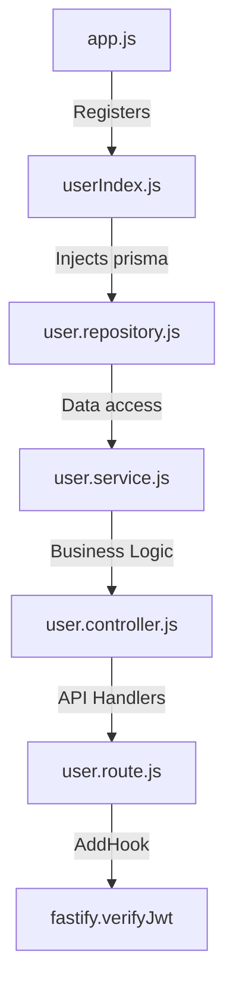
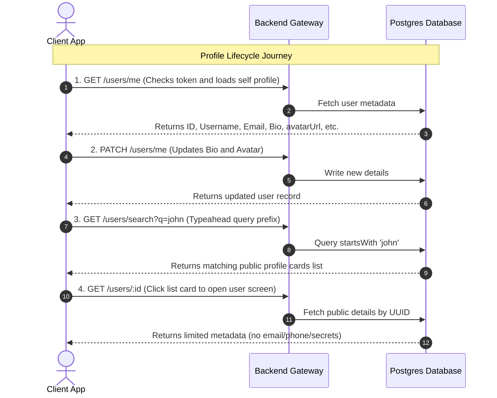

# Rhynk Users & Profile Module - Backend Integration & UI Guide

This document outlines the software flow, user journey, API integration procedures, request/response payloads, and high-fidelity UI design recommendations for the Users & Profile module of Rhynk.

---

## 1. System Architecture & Code Flow
The module is built using a strict 5-layer dependency-injected architecture to decouple database interactions from HTTP transport logic:



### Layer Responsibilities:
1. **[app.js](file:///home/omkarxo/Documents/Projects/Rhynk/server/src/app.js)**: Registers the user module under the root Fastify instance.
2. **[userIndex.js](file:///home/omkarxo/Documents/Projects/Rhynk/server/src/modules/user/userIndex.js)**: Wireframe bootstrapping. Injects the Prisma client (`fastify.prisma`) into the Repository, passes it to the Service, and registers the router with the prefix `/users`.
3. **[user.route.js](file:///home/omkarxo/Documents/Projects/Rhynk/server/src/modules/user/user.route.js)**: Maps REST paths to controller methods and applies a global `preHandler` hook (`fastify.verifyJwt`) to ensure all paths are authenticated.
4. **[user.validator.js](file:///home/omkarxo/Documents/Projects/Rhynk/server/src/modules/user/user.validator.js)**: Validates incoming request parameters, queries, and bodies at the framework layer.
5. **[user.controller.js](file:///home/omkarxo/Documents/Projects/Rhynk/server/src/modules/user/user.controller.js)**: Receives verified requests, extracts inputs (such as the authenticated `userId` from `request.user` or parameters), invokes the service, and sends a standardized success response.
6. **[user.service.js](file:///home/omkarxo/Documents/Projects/Rhynk/server/src/modules/user/user.service.js)**: Evaluates business rules (e.g. checking for username conflicts and stripping password hashes/sensitive details from user data).
7. **[user.repository.js](file:///home/omkarxo/Documents/Projects/Rhynk/server/src/modules/user/user.repository.js)**: Direct data access layer queries against PostgreSQL via Prisma.

---

## 2. User Journey & Product Flow

The profile system supports the user lifecycle through four key stages:



---

## 3. UI Design Recommendations (Web & Mobile)

To deliver a premium, modern user experience, implement the following design guidelines:

### A. Profile Dashboard (`/users/me` page)
* **Glassmorphism Panels**: Use subtle translucent backgrounds with blur filters (`backdrop-filter: blur(12px)`) and thin borders (e.g., `border: 1px solid rgba(255, 255, 255, 0.1)`) over vibrant gradient backdrops to give a premium, glass-like appearance.
* **Avatar Upload State**: When hovering over the avatar, overlay a semi-transparent dark mask with a camera icon. Clicking it opens a file selector. Show a circular spinner inside the circle while uploading to Cloudflare R2.
* **Inline Fields Editing**: Let users edit status text and bio inline. When a field is focused, show an clean underline expansion micro-animation. Include a character counter (e.g., `0 / 160` for bio) that turns amber at 90% capacity and red at 100%.

### B. User Search (`/users/search` page)
* **Autocomplete & Debouncing**: As the user types, wait **300ms** (debouncing) before firing the `/users/search?q=` API request to prevent unnecessary network requests.
* **Skeleton/Shimmer Loading**: While fetching search results, display 3 to 5 animated skeleton elements (grey gradient bars shifting left-to-right) instead of a simple spinning wheel.
* **Highlight Matching Query**: Format the search card list to highlight matching characters (e.g., searching "jo" displays "**Jo**hn Doe").

### C. Public Profile Modal (`/users/:id` modal)
* **Direct Chat Call-to-Action**: Provide a prominent CTA button labeled "Send Message" that links directly to a chat room using the user's UUID.
* **Activity Indicator**: Translate the `lastSeenAt` timestamp into human-readable strings (e.g. "online", "active 5m ago", "offline"). Render a small green dot adjacent to their avatar if they were active within the last 3 minutes.

---

## 4. API Endpoints, Payloads, & Responses

Every API request requires an Authorization header: `Authorization: Bearer <accessToken>`.

### A. Get Current User Profile
Retrieves the logged-in user's complete profile information.

* **Method/Path**: `GET /users/me`
* **Request Payload**: None
* **Success Response (`200 OK`)**:
  ```json
  {
    "success": true,
    "message": "Profile retrieved successfully",
    "data": {
      "id": "c7a8b3cd-0a1b-2c3d-4e5f-6a7b8c9d0e1f",
      "username": "jane_doe",
      "name": "Jane Doe",
      "phone": "+919876543210",
      "email": "jane@example.com",
      "avatarUrl": "https://r2.rhynk.app/avatars/c7a8b3cd.png",
      "bio": "Music status: enjoying sync-play!",
      "statusText": "In a music room 🎵",
      "isVerified": true,
      "lastSeenAt": "2026-07-16T02:40:00.000Z",
      "createdAt": "2026-07-10T12:00:00.000Z",
      "updatedAt": "2026-07-16T02:40:00.000Z"
    }
  }
  ```

---

### B. Update Profile Details
Partially updates the current user's profile attributes.

* **Method/Path**: `PATCH /users/me`
* **Request Payload**:
  ```json
  {
    "username": "jane_doe_new",
    "name": "Jane Mary Doe",
    "bio": "Avid music sync fan & chat manager",
    "avatarUrl": "https://r2.rhynk.app/avatars/c7a8b3cd_new.png",
    "statusText": "Busy 🎧"
  }
  ```
  *(Note: All fields are optional. Unsent fields remain unchanged).*
* **Success Response (`200 OK`)**:
  ```json
  {
    "success": true,
    "message": "Profile updated successfully",
    "data": {
      "id": "c7a8b3cd-0a1b-2c3d-4e5f-6a7b8c9d0e1f",
      "username": "jane_doe_new",
      "name": "Jane Mary Doe",
      "phone": "+919876543210",
      "email": "jane@example.com",
      "avatarUrl": "https://r2.rhynk.app/avatars/c7a8b3cd_new.png",
      "bio": "Avid music sync fan & chat manager",
      "statusText": "Busy 🎧",
      "isVerified": true,
      "lastSeenAt": "2026-07-16T02:45:00.000Z",
      "createdAt": "2026-07-10T12:00:00.000Z",
      "updatedAt": "2026-07-16T02:45:00.000Z"
    }
  }
  ```
* **Errors to Handle**:
  * `409 Conflict` (`USERNAME_TAKEN`): The new username is already owned by another account.

---

### C. Get Public Profile of Another User
Retrieves public information for a specific user ID. Excludes private details like email, phone, and verification boolean.

* **Method/Path**: `GET /users/:id`
* **Path Parameter**: `id` (must be a valid UUID v4)
* **Request Payload**: None
* **Success Response (`200 OK`)**:
  ```json
  {
    "success": true,
    "message": "Public profile retrieved successfully",
    "data": {
      "id": "e8c9d0e1-4e5f-6a7b-0a1b-c7a8b3cd2c3d",
      "username": "alex_music",
      "name": "Alex Mercer",
      "avatarUrl": "https://r2.rhynk.app/avatars/e8c9d0e1.png",
      "bio": "Grooving with friends",
      "statusText": "DJ Mode Active 🎚️",
      "lastSeenAt": "2026-07-16T02:30:00.000Z",
      "createdAt": "2026-07-12T08:00:00.000Z"
    }
  }
  ```
* **Errors to Handle**:
  * `404 Not Found` (`USER_NOT_FOUND`): User ID does not exist.

---

### D. Search Users by Username Query
Searches the user table for records whose usernames start with the query string.

* **Method/Path**: `GET /users/search`
* **Query Parameter**: `q` (minimum length of 1 character)
* **Request Payload**: None
* **Success Response (`200 OK`)**:
  ```json
  {
    "success": true,
    "message": "Users search completed successfully",
    "data": [
      {
        "id": "e8c9d0e1-4e5f-6a7b-0a1b-c7a8b3cd2c3d",
        "username": "alex_music",
        "name": "Alex Mercer",
        "avatarUrl": "https://r2.rhynk.app/avatars/e8c9d0e1.png",
        "bio": "Grooving with friends",
        "statusText": "DJ Mode Active 🎚️",
        "lastSeenAt": "2026-07-16T02:30:00.000Z",
        "createdAt": "2026-07-12T08:00:00.000Z"
      }
    ]
  }
  ```
