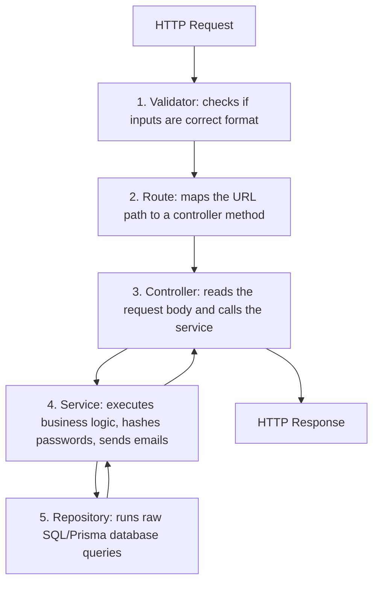

# 🎓 Guide: Understanding the Rhynk Auth System & Fastify Architecture

Welcome, my friend! This guide is designed to explain how the Rhynk auth system works under the hood. We will look at why we use Fastify, how it differs from Express, what each file and folder does, and walk through the exact code-wise flow of our authentication.

---

## 🚀 Part 1: Fastify vs. Express (Why Fastify?)

If you come from Express, Fastify might look a bit different. Let’s compare them.

### 1. Express Middlewares vs. Fastify Plugins
* **Express**: Middlewares are just functions executed sequentially: `(req, res, next) => { ... next(); }`. Any middleware can modify the `req` object, which can cause naming collisions and makes tracing where variables come from difficult.
* **Fastify**: Uses a **Plugin System** structured as a tree (a Directed Acyclic Graph). Fastify has **encapsulation**: by default, a plugin cannot leak its variables or decorators to other plugins unless you wrap it with `fastify-plugin` (`fp`).

### 2. What is a Decorator?
In Express, to share a database client, you might attach it to `req.db = db`. 
In Fastify, you **decorate** the Fastify server instance:
```javascript
fastify.decorate('prisma', prismaClient);
```
Now, any route handler or controller in the app can access the database using `fastify.prisma` or `this.prisma` directly. It is clean, explicit, and fast.

### 3. Lifecycle Hooks vs. Express Middleware
Fastify breaks the request lifecycle into strict hooks:
1. `onRequest`: Request received.
2. `preValidation`: Before running JSON validation.
3. `preHandler`: Run route-level auth checks (like checking JWTs).
4. `handler`: The controller code itself.
5. `onResponse`: Response sent back to client.

This strict structure makes Fastify much faster than Express.

### 4. Did we make a mistake choosing Fastify?
**No! Fastify is a superior choice for Rhynk.** 
* **Speed**: Fastify is up to **3x–4x faster** than Express because it compiles JSON schemas into highly optimized Javascript functions for input validation and output serialization.
* **Validation**: Fastify has built-in validation using AJV. Express requires third-party packages.
* **Scalability**: Rhynk is a real-time messaging and music app. We need low-latency WebSocket and HTTP connections. Fastify handles concurrent connections with much less memory overhead than Express.

---

## 📂 Part 2: Project Folder Structure

Here is how the backend code is organized:

```text
server/
├── prisma/
│   └── schema.prisma        # PostgreSQL tables (System of Record)
└── src/
    ├── app.js               # Composition Root (Registers plugins & modules)
    ├── server.js            # Bootstrapper (Starts the HTTP listener)
    ├── config/
    │   └── env.js           # Validates .env variables on boot
    ├── middlewares/
    │   └── errorHandler.js  # Global error catch-all
    ├── plugins/
    │   ├── prisma.plugin.js     # Connects to PostgreSQL, binds fastify.prisma
    │   ├── mongoose.plugin.js   # Connects to MongoDB, binds fastify.mongo
    │   ├── redis.plugin.js      # Connects to Redis, binds fastify.redis
    │   └── mailer.plugin.js     # Seeds templates, binds fastify.sendEmail
    └── modules/
        └── auth/            # Wires up routes, validation, and auth flows
```

---

## 🏛️ Part 3: The 5-Layer Module Pattern (Noob-Friendly)

Every folder inside `src/modules/` represents a feature (like `auth`). Inside that folder, we split the code into **5 layers** to keep the code clean and easy to test:



### 1. The Validator (`auth.validator.js`)
* **Role**: The Bouncer.
* **What it does**: Defines JSON schemas. It checks if the signup request contains `username`, `email`, `password`, and `name`. If the email is missing an `@`, it blocks the request immediately with a `400 Bad Request` before hitting the database.

### 2. The Route (`auth.routes.js`)
* **Role**: The Road Map.
* **What it does**: Tells Fastify which URL endpoints map to which Controller methods. It binds our Validators and Auth Guards (`preHandler`) to specific URLs.

### 3. The Controller (`auth.controller.js`)
* **Role**: The Receptionist.
* **What it does**: Reads the HTTP request headers/body, calls the Service layer, and sends back a standardized JSON response using `successResponse` or `errorResponse`.
* **Important**: It contains **zero business logic**. It only acts as an HTTP adapter.

### 4. The Service (`auth.service.js`)
* **Role**: The Brains.
* **What it does**: This is where your actual application rules live. It hashes passwords, generates random OTPs, checks Redis keys, and triggers emails. It doesn't know anything about HTTP requests or databases; it just receives parameters and processes them.

### 5. The Repository (`auth.repository.js`)
* **Role**: The Librarian.
* **What it does**: The only place in your module that touches PostgreSQL via Prisma. It runs queries like `prisma.user.create()` or `prisma.user.findUnique()`. It knows nothing about OTPs, hashing, or security tokens—its only job is reading and writing data.

---

## 🔄 Part 4: Code-Wise Authentication Flows

Let’s trace the execution steps for the three main auth flows:

### 1. Sign Up (Register) Flow
When a client sends a request to `POST /auth/register`:
1. **Validator** checks if `username`, `email`, `password`, and `name` are present.
2. **Controller** extracts these parameters and calls `authService.register({ username, email, password, name })`.
3. **Service** checks if the email is already taken:
   ```javascript
   const existingUser = await this.repository.findUserByEmail(email);
   ```
   * If the email is already registered and verified, it throws a `409 taken` error.
   * If it is new, the Service hashes the password using `bcrypt` and calls the repository:
     ```javascript
     const user = await this.repository.createUser({ username, email, passwordHash, name });
     ```
4. **Service** calls `this.sendOtp(email)`:
   * Generates a 6-digit random code (e.g. `123456`).
   * Saves it to Redis under `otp:email` with a **1-minute** TTL.
   * Saves a cooldown key `otp:cooldown:email` to Redis with a **30-second** TTL to prevent spam.
   * Calls `sendEmail(email, 'otp_verification', { otp, username: name })`.
5. **Controller** returns `201 Registration OTP sent successfully`.

---

### 2. Verification Flow
When the user submits the OTP code to `POST /auth/otp/verify`:
1. **Service** queries Redis:
   ```javascript
   const storedOtp = await this.redis.get(`otp:${email}`);
   ```
   * If missing or mismatching, it throws `Invalid or expired OTP`.
2. **Service** updates the Postgres record:
   ```javascript
   await this.repository.verifyUser(user.id);
   ```
3. **Service** triggers the welcome email asynchronously (it does not `await` it, so the response is fast!):
   ```javascript
   this.sendEmail(user.email, 'welcome_email', { username: user.name || user.username })
   ```
4. **Service** calls `issueTokens` (see Token Rotation below) and returns access/refresh tokens.

---

### 3. Token Rotation & Session Management (Redis Security)
To keep the app secure, we use two tokens:
1. **Access Token (JWT)**: Valid for **15 minutes**. Sent in the Authorization header. Contains the user's `userId` and `deviceId`.
2. **Refresh Token (JWT)**: Valid for **7 days**. Used to request new Access Tokens.

#### How we prevent Token Theft (Replay Attack Mitigation)
If an attacker steals a user's Refresh Token, we detect it using Redis:
* When a Refresh Token is issued, we save it in Redis:
  `Key: session:userId:deviceId  -> Value: refreshToken`
* When a user requests a new token via `POST /auth/refresh`, the Service checks if the token they sent matches the value in Redis.
* **If it matches**: We rotate it. We issue a new Refresh Token, update Redis with the new token, and return it.
* **If it does NOT match**: This implies a **replay attack** (either the user or the attacker is using an old, rotated token). 
  * **Action**: We immediately delete **all** active session keys for that user (`session:userId:*`). This instantly logs out the user from **all** devices globally for their safety.

---

## 🗝️ Part 5: Active Redis Keys List

Here is the exact Redis key space map we use:

| Key Pattern | Data Type | TTL | Purpose |
| :--- | :--- | :--- | :--- |
| `otp:{{email}}` | String | 60 seconds | Stores the active 6-digit verification code. |
| `otp:cooldown:{{email}}` | String | 30 seconds | Blocks resending a new OTP code too quickly. |
| `session:{{userId}}:{{deviceId}}` | String | 7 days | Stores the active Refresh Token for session validation. |
| `lock:refresh:{{refreshToken}}` | String | 5 seconds | Lock to avoid race conditions when refreshing tokens concurrently. |
| `email_template:{{templateKey}}:v1` | String | 24 hours | Cache for our MongoDB email templates to ensure speed. |
